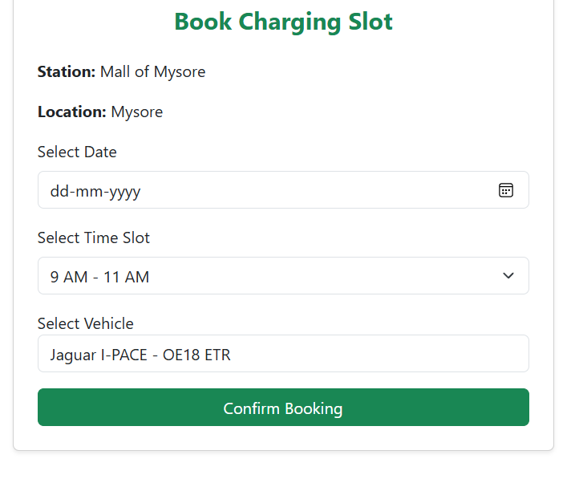

# EV Charging Station Booking System

A Django-based web application for booking and managing EV charging stations.

## Features
- User authentication and role-based access
- EV slot booking and management
- Vehicle registration
- Admin-controlled charging workflow
- Booking approval and tracking
- Payment integration (simulation)

## Tech Stack
- Python
- Django
- MySQL
- HTML, CSS, Bootstrap

## Installation & Setup
1. Clone the repository
2. Create virtual environment
3. Install dependencies
   pip install -r requirements.txt
4. Configure environment variables (.env)
5. Run migrations
   python manage.py migrate
6. Start server
   python manage.py runserver

## Screenshots

### Login Page

### Slot Booking

### Admin Panel

### Charging Status

## Author
Jibin T Babu
